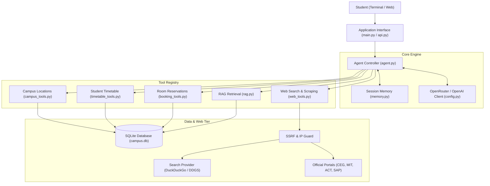
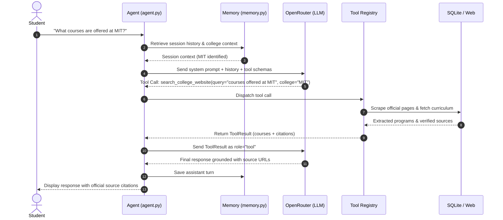
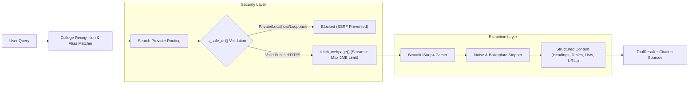

# AI Campus Assistant Agent — System Architecture

## 1. System Overview

The **AI Campus Assistant Agent** is an intelligent, multi-turn conversational system engineered for university students and administrators. It combines native Large Language Model (LLM) tool-calling, autonomous web discovery and scraping of official college websites, session-isolated conversation memory, and atomic SQLite transactional operations for student schedules and facility reservations.



---

## 2. Agent Workflow & Execution Loop

The conversational agent operates on a reactive, bounded ReAct (Reason + Act) loop:



### Iteration Boundaries & Safety
* **Max Iterations:** Capped at `MAX_TOOL_ITERATIONS = 5` to prevent infinite tool-call recursion.
* **Error Resilience:** Catch and format API timeouts, network disconnections, and authentication errors gracefully without unhandled crashes.
* **JSON Validation:** Strictly catch `JSONDecodeError` on model function arguments and inject structured error responses back to the LLM.

---

## 3. Tool Registry & Routing

| Tool Name | Module | Responsibility | Key Arguments |
| :--- | :--- | :--- | :--- |
| `search_campus_location` | `campus_tools.py` | Locate labs, halls, buildings, landmarks, or list all locations | `name: str` |
| `get_student_timetable` | `timetable_tools.py` | Query day-specific, today/tomorrow, or weekly schedules | `student_id: int`, `day: str` |
| `check_room_availability` | `booking_tools.py` | Interval conflict checking for classrooms and seminar halls | `booking_date: str`, `start_time: str`, `end_time: str` |
| `book_room` | `booking_tools.py` | Atomic reservation of a facility with transaction isolation | `student_id: int`, `room_name: str`, `booking_date: str`, `start_time: str`, `end_time: str`, `purpose: str` |
| `get_booking_details` | `booking_tools.py` | Retrieve existing reservation status and metadata | `booking_id: str` |
| `cancel_room_booking` | `booking_tools.py` | Authorized reservation cancellation | `booking_id: str`, `student_id: int` |
| `search_college_website` | `web_tools.py` | Search official college sites, scrape content, and cite source links | `query: str`, `college: str` (optional) |
| `fetch_webpage` | `web_tools.py` | Safely download and parse public HTTP/HTTPS documents | `url: str` |

---

## 4. Web Search and Scraping Architecture



### Security & Compliance
1. **SSRF Guard:** Performs DNS resolution before making requests; actively blocks `localhost`, `127.0.0.1`, RFC 1918 private subnets (`10.0.0.0/8`, `172.16.0.0/12`, `192.168.0.0/16`), and link-local cloud metadata endpoints (`169.254.169.254`).
2. **Resource Boundaries:** Hard request timeout of 15 seconds; streaming content download capped at 2,000,000 bytes (2 MB).
3. **Respectful Retrieval:** Custom user-agent header; respects content types (skips binaries, flags PDFs) and applies per-domain rate limiting.
4. **Ephemeral In-Memory Pipeline:** Scraped page content is processed strictly in transient request memory to answer the student's question and is immediately discarded. No scraped text, extracted HTML, or course lists are written to SQLite, persistent cache tables, disk files, or vector databases.

---

## 5. Room Booking Interval Logic

Reservations use half-open intervals `[start_time, end_time)` normalized to 24-hour `HH:MM` format.

```mermaid
gantt
    title Room Reservation Interval Examples
    dateFormat HH:mm
    axisFormat %H:%M
    section Booking 1
    Existing Reservation [10:00 to 12:00) :active, b1, 10:00, 12:00
    section Overlapping
    Rejected Reservation [11:00 to 13:00) :crit, b2, 11:00, 13:00
    section Adjacent
    Allowed Reservation [12:00 to 14:00) :done, b3, 12:00, 14:00
```

Two intervals `[A_start, A_end)` and `[B_start, B_end)` conflict if and only if:
$$\text{Conflict} = (A_{\text{start}} < B_{\text{end}}) \land (A_{\text{end}} > B_{\text{start}})$$

When an existing booking ends at `12:00` and a new booking starts at `12:00`:
$$12:00 > 12:00 \implies \text{False (No Conflict)}$$
This allows consecutive sessions to use the same room without wasted gap time.

---

## 6. Conversation Memory & Session Isolation

* **Sliding Window:** Preserves the last 20 messages per session to prevent LLM context-window exhaustion while retaining immediate context.
* **Context Carry-Over:** Remembers active college code (e.g., `MIT`) across follow-up queries.
* **Multi-Student Isolation:** Each student or session operates in a decoupled memory container (`SessionMemory`), ensuring personal timetables and bookings are never leaked between students.
